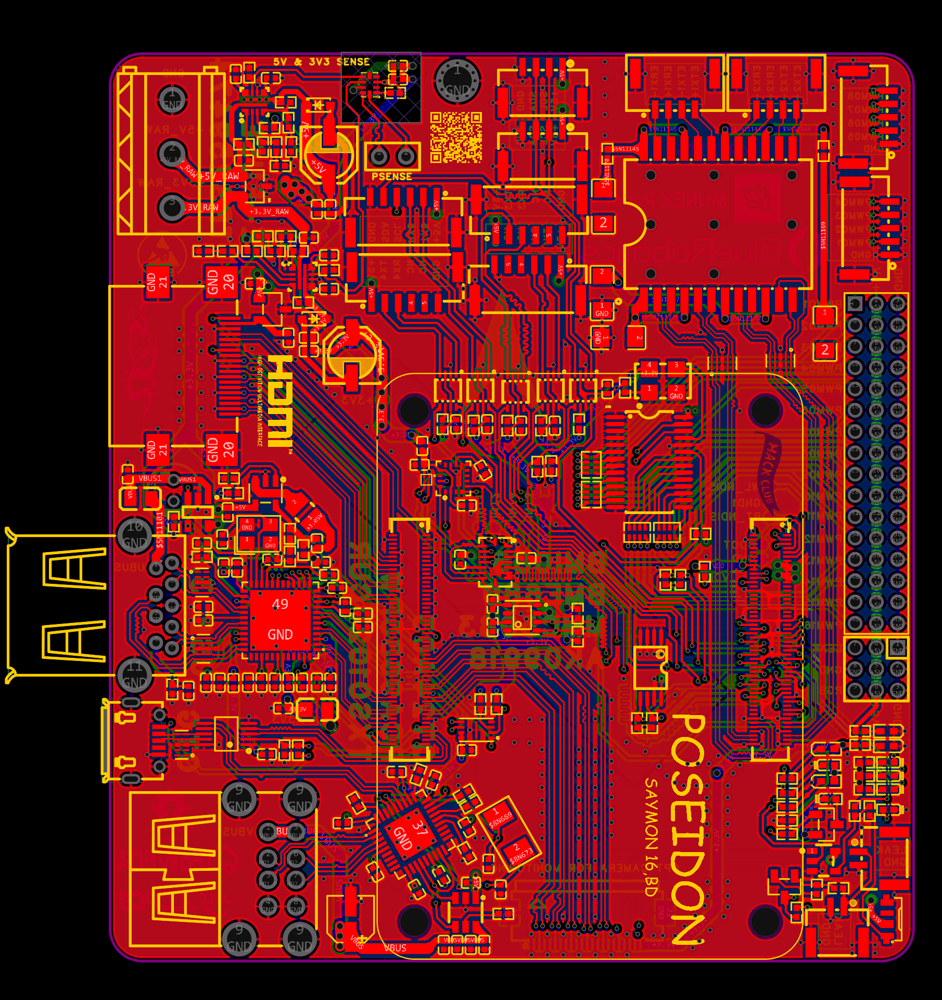
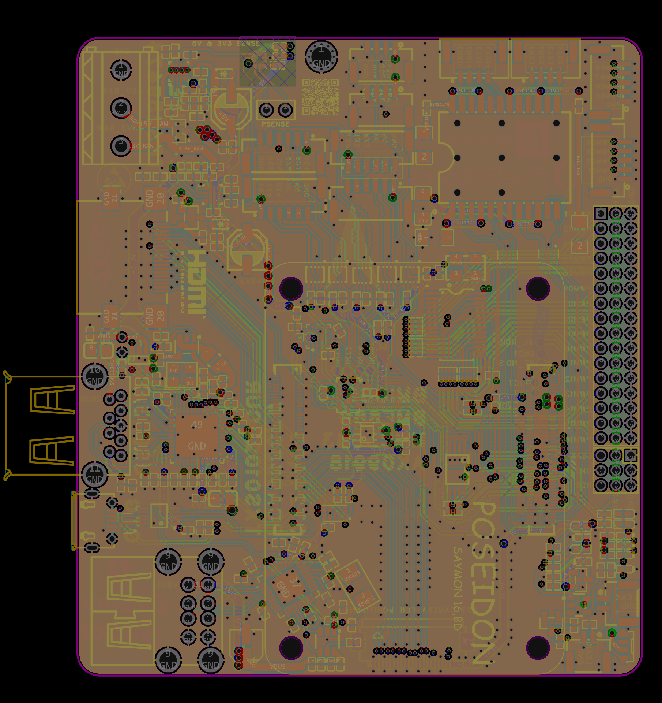
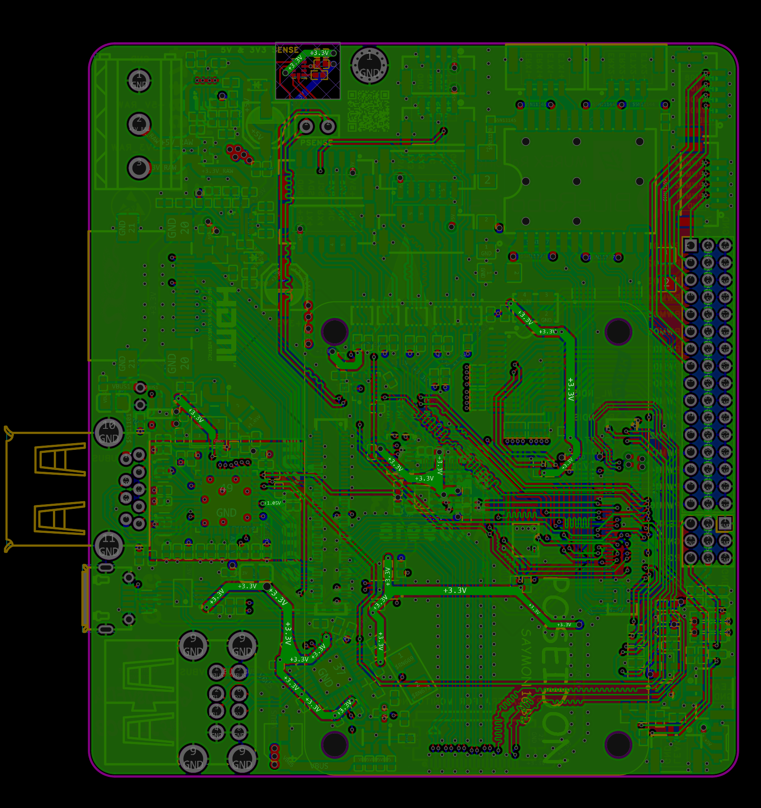
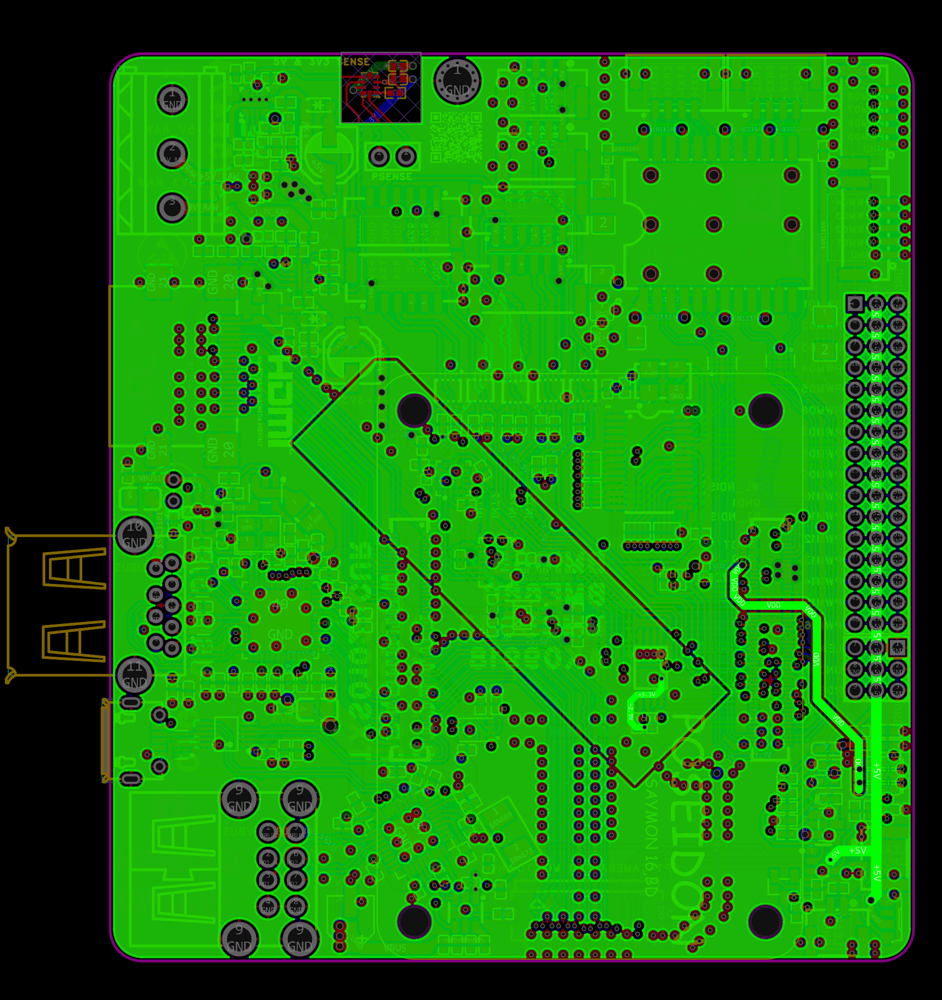
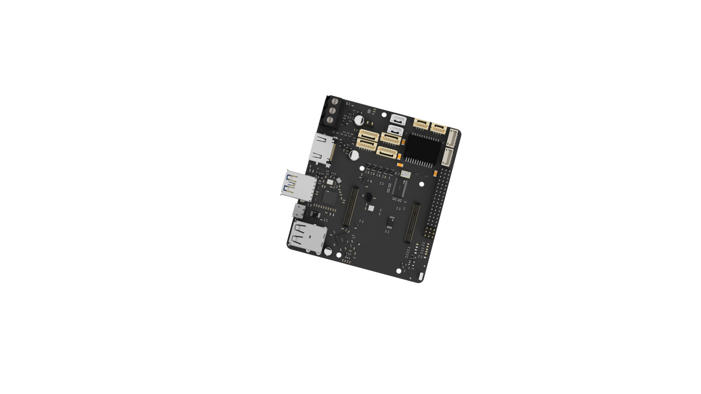

# POSEIDON 

.png>)

POSEIDON is a robotics control system, focused on ROV systems. It is a open-source CM4-based ROV control board, with the implementation of a USB3.0 controller, and low-cost USB2.0 hub and micro USB-OTG

With a physical footprint of 75.5 mm x 85.2 mm (2.97 in x 3.35 in), the MUREX Carrier Board is suitable for embedded and space-limited applications. 

# Description 

POSEIDON is a robotics-oriented application of the Raspberry Pi Compute Module 4, optimized for ROV control. The design utilizes an Analog to Digital Converter, a PCA9685 for 16 PWM output, BME680 environmental sensor, MMC5983 magnetometer with AK09918 compass, and BMI088 inertial measurement unit (IMU), allowing for a 9 DoF AHRS, full array gas sensing, IEEE 802.11b/g/n (2.4 GHz Wi-Fi), and Bluetooth® 5 (LE). The power input consists of dual TPS259474LRPWR eFuses for 3.3V and 5V, offering OVLO, UVLO, OC, slew rate control, reverse polarity, and analog current monitoring. In addition to 5V and 3.3V input, onboard high-efficiency DC-DC converters allow for high power 1.05V output. The uPD720202 xHCI USB3.0 interface allows for SuperSpeed USB connectivity and external Ethernet magnetics enable compact Gigabit ethernet. The ADS1115 converts the Power Sensing Inputs to I2C where the Sensors are all SPI lines (Length Tuned) . All vital data lines are protected against transients. There are on-board system feedback LEDs for input power, Ethernet and CM4 activity/power. 3 user-addressable RGB LEDs, 16 PWM Connectors with 5V power and 2 separate shared 4 lane PWM, Pins for RGB Strip, 1x 3p and 2x 2P GH Connector for Leak Sensor, 3x Single Lane RX/TX GH Connector, 1x full flex I2C & RX/TX Combined and multiple I2C/SPI lines and Connector available across the board and CM4 enables POSEIDON to be a fully-featured ROV control system

# Integrated Sensors/ICs 

### BME680 (Enclosure Pressure, Humidity, Temperature, VOC) 
    Accurate environmental sensor within enclosure

### MMC5983 (Magnetometer), AK009918 (Compass) & BMI088 (IMU)
    High accuracy 9-DOF MEMS sensor (±1˚ magnetic heading, ±0.004˚/s gyroscopic heading, ±0.09 mg acceleration)
    Optional : A I2C Connector is given for external pressure sensor

### Leak Sensor
    There are 3 ways to connect a Leak Sensor and a dedicated LED is given for the Indication

### TPS259474LRPWR (eFuse)
    5V and 3.3V independent input protection

### ADS1115 (Analog to I2C)
    Converts the Two ILIM analog line from eFuse to I2C to go the CORE I2C Bus 

### PCA9685 (SPI to PWM)
    Uses SPI signal to output 16 PWM pins which can be used for ESC, Lumen, Camera Tilt etc.

### M24C32 (Eeprom)
    Used for saving Bootloader Settings and Firmware

### TXS0102 (Logic Converter)
    Pulls Up the GPIOs from CM4 and provides better a single lane I2C and 4 Lane Tx/Rx Lines

### uPD720202 (USB 3.0)
    USB host controller LSI compatible with the USB 3.0 and xHCI (eXtensible Host Controller Interface) 1.0 specifications

### AP3429KTTR-G1 (1.05V DC-DC Converter)
    1MHz 2A DC-DC converter

### USB2514 (USB2.0 HUB) & FSUSB42MUX (Micro USB-OTG)
    Converts CM4's USB Line and OTG ID into Two USB2.0 and a MicroUSB OTG

### More
    Full system protection on power rails
    Transient protection on vital data lines
    5V and 3.3V power rail LEDs (Debug/Status)
    3 User Addressable Leds
    Ethernet G/Y LEDs (Debug/Status)
    SK6812 indication for RGB Strip

# Schematics & PCB
  The project was fully made with Easyeda Pro and design hours are logged and documented

[Schematics V1](<SCH_Schematic_2026-07-08.pdf>)

### Front Layer

### Inner 1 - GND Plane 

### Inner 2

 
### Inner 3 - Power 

### Inner 4 - GND Plane

    
### Bottom Layer

.png>)

# BOM 
  [BOM](BOM.csv)

# Code & Firmware

  [BlueOS](https://blueos.cloud/docs/stable/usage/overview/) will be the primary operating system for this board. Only the OS can be determined for now. Sensor calibaration depends on Ardupilot which needs to be done IRL. Also, there is a lot of factor goes on configuring it like as - Power Board, Ethernet Switch, ESC model and type, Grippers and accessories. These things are for full ROV build. So, for the carrier BlueOs installation [guide](https://blueos.cloud/docs/stable/usage/installation/) will be enough after getting the board. I have to sort out the whole ROV comps and then will do a seperate software project for this Carrier

1. To boot the emmc on CM4 use the Micro USB-OTG port on the carrier along with connecting a jumper with the test Pads behind the board named "BOOT" and "GND"  and follow [this](https://youtu.be/SWv-WYlHJWQ?si=i7sY6wG8Rz0ZF506) awsome guide for the next steps. On the [1:25](https://youtu.be/SWv-WYlHJWQ?t=85), choose (raspberry pi os other).

2. Before selecting the Os. Download the latest xbookworm.zip file from [this repo](https://github.com/bluerobotics/BlueOS) Then extract it and get the image file. On the PI Imager tool select the BlueOs image and you done.

3.Also, this carrier has Eeprom. So, to flash the Eeprom is also easy too. Follow [this](https://www.raspberrypi.com/documentation/computers/compute-module.html#flash-compute-module-bootloader-eeprom) guide while performing the above steps. For jumpering Eeprom use Test Pads in the Bottom Layer named "EEPROM" and "GND"

# Credit 

[Blue Robotics](https://bluerobotics.com/) & Murex Robotics

# AI Usage 

AI was used for information gather, clarity, research and fetching only. No AI has been used to do elecrical routing of the actual board. All the routings are manual and video logged
